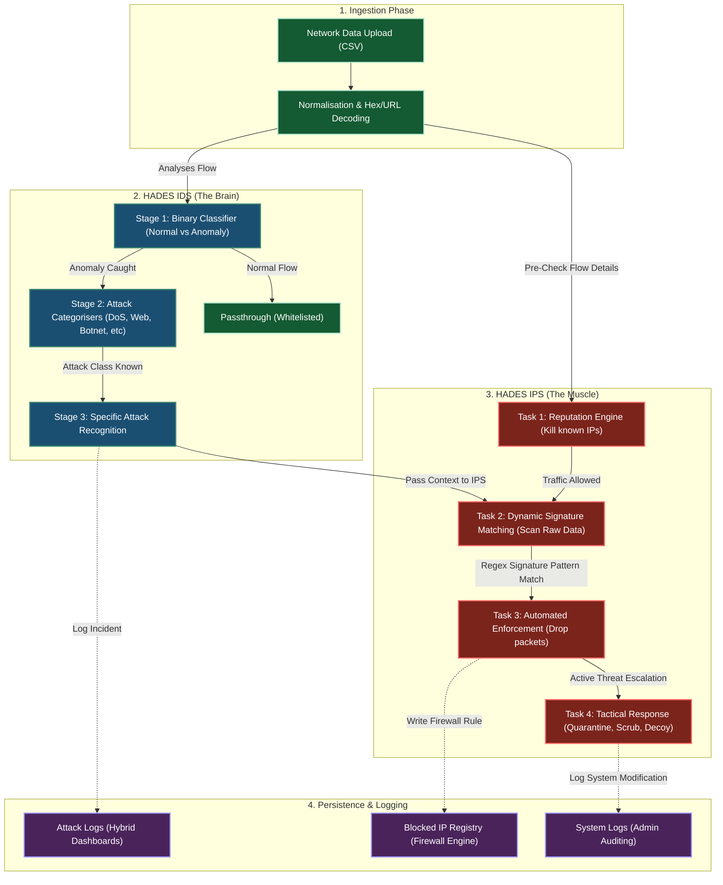

# HADES Core Architecture Diagram

This diagram maps out the exact flow of data through the HADES core, displaying how the **IDS Engine (The Brain)** and the **IPS Engine (The Muscle)** work seamlessly together to intercept threats.

> [!TIP]
> **Reading Guide**: Follow the arrows starting from the **Ingestion Phase**. The blue blocks represent the machine-learning pipeline, while the red blocks represent active defensive enforcement.

### Components Breakdown

1.  **Ingestion Phase**: This is the entry point where you upload your standard CIC-IDS2018 datasets. It strips away incompatible inputs, resolves `NaN` and `infinite` fields, and URL/Hex decodes the payload parameters so malware cannot hide.
2.  **HADES IDS**: This section uses your pre-trained models. First, it identifies if a flow is purely an anomaly. If it is, the flow gets thrown to the secondary neural nets (Stage 2 & 3) to correctly identify whether it's a brute force, an SQL injection, or lateral movement.
3.  **HADES IPS**: This is what you just enabled! It doesn't rely solely on machine-learning guesswork. It checks the dataset rows directly against a hardcoded whitelist/blacklist (Reputation Engine) and hundreds of custom regex rules (Signature Matching). When something is identified, it drops the flow and triggers active measures like quarantining.
4.  **Persistence**: The resulting actions from both tools are split. The IDS writes to `AttackLog` to render your Hybrid Dashboards, while the IPS writes to `SystemLog` and `BlockedIP` to actively command the firewall rules on the Response Dashboard.
